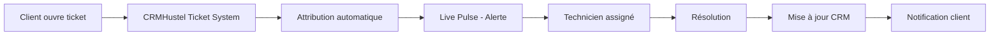

# 🎯 Vision de Travail - Service de Formulaire
## Cloud Nexus Platform - Hébergement, Live Pulse & CRMHustel

*Date: 10 Janvier 2026*  
*Branche: btrt*

---

## 📊 État Actuel du Projet

### ✅ Composants Existants
- **HeadlessCMS** (`/cms`) - Gestionnaire de contenu
- **ServiceRequestForm** (`/request-service`) - Formulaire de demande de service
- **Live Pulse Dashboard** (`/live-pulse`) - Tableau de bord de surveillance en temps réel
- **Cloud Infrastructure** - Gestion des ressources cloud
- **Authentication** - Système d'authentification multi-rôles
- **E-commerce** - Shop et Storefront

### ⚠️ Points d'Attention
1. **Warning Build**: Chunk size > 500kB (optimisation recommandée)
2. **Dynamic Import**: chat.service.ts importé statiquement et dynamiquement
3. **Browserslist**: Données obsolètes (7 mois)

---

## 🏗️ Architecture du Service de Formulaire

### 1️⃣ **Module d'Hébergement (Hosting Service)**

#### Objectifs
- Permettre aux clients de commander des services d'hébergement
- Gérer les demandes de ressources (CPU, RAM, Storage)
- Intégration avec le système de facturation

#### Composants à Créer

```
src/features/hosting/
├── components/
│   ├── HostingPlans.tsx           # Affichage des plans d'hébergement
│   ├── HostingConfigForm.tsx      # Configuration personnalisée
│   ├── DomainSelector.tsx         # Sélection de domaine
│   └── HostingQuoteCalculator.tsx # Calculateur de devis
├── routes/
│   ├── HostingDashboard.tsx       # Dashboard hébergement
│   └── HostingRequest.tsx         # Formulaire de demande
├── hooks/
│   ├── useHostingPlans.ts         # Gestion des plans
│   └── useHostingRequest.ts       # Soumission de demandes
├── services/
│   └── hosting.service.ts         # API calls hébergement
└── types/
    └── hosting.types.ts           # Types TypeScript
```

#### Fonctionnalités Principales
1. **Sélection de Plan**
   - Starter (1GB RAM, 10GB Storage, 1 vCPU)
   - Professional (4GB RAM, 50GB Storage, 2 vCPU)
   - Enterprise (16GB RAM, 200GB Storage, 8 vCPU)
   - Custom (Configuration personnalisée)

2. **Formulaire de Demande**
   - Informations client
   - Sélection du plan
   - Configuration technique
   - Choix du domaine
   - Options additionnelles (SSL, Backup, CDN)

3. **Calcul de Prix Dynamique**
   - Basé sur les ressources sélectionnées
   - Affichage mensuel/annuel
   - Remises pour engagement long terme

---

### 2️⃣ **Module Live Pulse (Monitoring & Analytics)**

#### Objectifs Existants ✅
- Dashboard de surveillance en temps réel
- Métriques de performance
- Alertes et notifications

#### Améliorations à Implémenter

```
src/features/livepulse/
├── components/
│   ├── ServiceHealthMonitor.tsx   # Monitoring de santé des services
│   ├── RequestFormAnalytics.tsx   # Analytics des formulaires
│   ├── UserActivityTracker.tsx    # Suivi d'activité
│   └── AlertsManager.tsx          # Gestion des alertes
├── hooks/
│   ├── useRealTimeMetrics.ts      # Métriques temps réel
│   └── useServiceHealth.ts        # État de santé
└── services/
    └── monitoring.service.ts      # Service de monitoring
```

#### Intégration avec Formulaires
1. **Tracking des Soumissions**
   - Nombre de demandes par type
   - Taux de conversion
   - Temps de traitement moyen

2. **Alertes Automatiques**
   - Nouvelle demande d'hébergement
   - Quota de ressources atteint
   - Erreurs de formulaire

3. **Analytics Dashboard**
   - Vue d'ensemble des demandes
   - Graphiques de tendances
   - Rapports exportables

---

### 3️⃣ **Module CRMHustel (Customer Relationship Management)**

#### Objectifs
- Centraliser toutes les interactions client
- Gérer le pipeline de vente
- Automatiser le suivi client

#### Composants à Créer

```
src/features/crmhustel/
├── components/
│   ├── CustomerDashboard.tsx      # Vue client
│   ├── LeadsPipeline.tsx          # Pipeline de vente
│   ├── QuoteManager.tsx           # Gestion des devis
│   ├── CommunicationHub.tsx       # Hub de communication
│   └── TicketSystem.tsx           # Système de tickets
├── routes/
│   ├── CRMDashboard.tsx           # Dashboard CRM
│   ├── CustomersView.tsx          # Liste clients
│   └── OpportunitiesView.tsx      # Opportunités
├── hooks/
│   ├── useCustomers.ts            # Gestion clients
│   ├── useLeads.ts                # Gestion leads
│   └── useTickets.ts              # Gestion tickets
├── services/
│   └── crm.service.ts             # API CRM
└── types/
    └── crm.types.ts               # Types CRM
```

#### Fonctionnalités Principales

1. **Gestion des Leads**
   - Import depuis formulaires (hébergement, service request)
   - Scoring automatique
   - Attribution aux commerciaux
   - Pipeline visuel (Drag & Drop)

2. **Gestion Client**
   - Profil complet client
   - Historique des interactions
   - Documents et contrats
   - Facturation intégrée

3. **Communication**
   - Messages internes
   - Emails automatiques
   - Notifications push
   - Rappels de suivi

4. **Système de Tickets**
   - Support technique
   - Gestion des incidents
   - Base de connaissances
   - SLA tracking

---

## 🔄 Flux de Travail Intégré

### Scénario 1: Demande d'Hébergement

```mermaid
graph LR
    A[Client remplit formulaire] --> B[ServiceRequestForm]
    B --> C[Validation données]
    C --> D[CRMHustel - Création Lead]
    D --> E[Live Pulse - Tracking]
    E --> F[Notification Commercial]
    F --> G[Création Devis]
    G --> H[Envoi au Client]
    H --> I[Confirmation & Facturation]
    I --> J[Provisionnement Cloud]
```



### Scénario 2: Support Client



---

## 🛠️ Plan de Développement

### Phase 1: Fondations (Semaine 1-2)
- [ ] Créer la structure de dossiers pour `hosting`, `livepulse`, `crmhustel`
- [ ] Définir tous les types TypeScript
- [ ] Créer les services API basiques
- [ ] Setup des routes dans App.tsx

### Phase 2: Module Hébergement (Semaine 3-4)
- [ ] Développer HostingPlans component
- [ ] Créer le formulaire de configuration
- [ ] Implémenter le calculateur de devis
- [ ] Intégrer avec le backend (server.js)
- [ ] Tests et validation

### Phase 3: Améliorations Live Pulse (Semaine 5)
- [ ] Ajouter tracking des formulaires
- [ ] Créer analytics dashboard
- [ ] Implémenter les alertes temps réel
- [ ] Intégration Socket.IO

### Phase 4: CRMHustel Core (Semaine 6-8)
- [ ] Développer le dashboard CRM
- [ ] Créer le pipeline de vente
- [ ] Implémenter la gestion des leads
- [ ] Système de tickets
- [ ] Communication hub

### Phase 5: Intégration & Optimisation (Semaine 9-10)
- [ ] Connecter tous les modules
- [ ] Tests end-to-end
- [ ] Optimisation des performances
- [ ] Correction du bundle size
- [ ] Documentation complète

### Phase 6: Déploiement (Semaine 11)
- [ ] Tests de production
- [ ] Migration des données
- [ ] Déploiement staging
- [ ] Déploiement production
- [ ] Formation utilisateurs

---

## 🎨 Design System

### Palette de Couleurs par Module

```css
/* Hosting Service */
--hosting-primary: hsl(210, 100%, 50%);    /* Bleu Cloud */
--hosting-secondary: hsl(210, 80%, 40%);
--hosting-accent: hsl(200, 100%, 60%);

/* Live Pulse */
--pulse-primary: hsl(142, 76%, 36%);       /* Vert Monitoring */
--pulse-secondary: hsl(142, 60%, 30%);
--pulse-accent: hsl(120, 100%, 50%);
--pulse-warning: hsl(38, 92%, 50%);
--pulse-danger: hsl(0, 84%, 60%);

/* CRMHustel */
--crm-primary: hsl(271, 76%, 53%);         /* Violet CRM */
--crm-secondary: hsl(271, 60%, 45%);
--crm-accent: hsl(280, 100%, 70%);
```

### Composants UI Communs
- Formulaires avec validation Zod
- Tables avec tri/filtrage
- Modals responsive
- Toast notifications
- Loading states
- Error boundaries

---

## 📊 Base de Données - Schema Prisma

### Nouvelles Tables à Ajouter

```prisma
// Hosting Services
model HostingPlan {
  id          String   @id @default(cuid())
  name        String
  description String?
  cpu         Int
  ram         Int
  storage     Int
  bandwidth   Int
  price       Float
  features    Json
  active      Boolean  @default(true)
  createdAt   DateTime @default(now())
  updatedAt   DateTime @updatedAt
  
  requests    HostingRequest[]
}

model HostingRequest {
  id              String   @id @default(cuid())
  userId          String
  planId          String
  domain          String?
  customConfig    Json?
  status          String   @default("pending") // pending, processing, active, cancelled
  totalPrice      Float
  billingCycle    String   // monthly, yearly
  notes           String?
  createdAt       DateTime @default(now())
  updatedAt       DateTime @updatedAt
  
  user            User     @relation(fields: [userId], references: [id])
  plan            HostingPlan @relation(fields: [planId], references: [id])
  crmLead         CRMLead?
}

// CRM System
model CRMLead {
  id                String   @id @default(cuid())
  customerId        String?
  source            String   // form, referral, cold-call, etc.
  status            String   @default("new") // new, contacted, qualified, proposal, won, lost
  priority          String   @default("medium") // low, medium, high
  assignedTo        String?
  estimatedValue    Float?
  probability       Int?     // 0-100
  expectedCloseDate DateTime?
  notes             String?
  createdAt         DateTime @default(now())
  updatedAt         DateTime @updatedAt
  
  customer          User?    @relation("CustomerLeads", fields: [customerId], references: [id])
  assignedUser      User?    @relation("AssignedLeads", fields: [assignedTo], references: [id])
  activities        CRMActivity[]
  tickets           CRMTicket[]
  hostingRequest    HostingRequest? @relation(fields: [hostingRequestId], references: [id])
  hostingRequestId  String?  @unique
}

model CRMActivity {
  id          String   @id @default(cuid())
  leadId      String
  type        String   // email, call, meeting, note
  subject     String
  description String?
  completedAt DateTime?
  createdBy   String
  createdAt   DateTime @default(now())
  
  lead        CRMLead  @relation(fields: [leadId], references: [id])
  creator     User     @relation(fields: [createdBy], references: [id])
}

model CRMTicket {
  id          String   @id @default(cuid())
  leadId      String?
  customerId  String
  subject     String
  description String
  priority    String   @default("medium")
  status      String   @default("open") // open, in-progress, resolved, closed
  category    String   // technical, billing, general
  assignedTo  String?
  resolvedAt  DateTime?
  createdAt   DateTime @default(now())
  updatedAt   DateTime @updatedAt
  
  lead        CRMLead? @relation(fields: [leadId], references: [id])
  customer    User     @relation("CustomerTickets", fields: [customerId], references: [id])
  assignedUser User?   @relation("AssignedTickets", fields: [assignedTo], references: [id])
  comments    TicketComment[]
}

model TicketComment {
  id        String   @id @default(cuid())
  ticketId  String
  userId    String
  content   String
  internal  Boolean  @default(false)
  createdAt DateTime @default(now())
  
  ticket    CRMTicket @relation(fields: [ticketId], references: [id])
  user      User      @relation(fields: [userId], references: [id])
}

// Update User model to add relations
model User {
  // ... existing fields ...
  
  // CRM Relations
  customerLeads      CRMLead[]      @relation("CustomerLeads")
  assignedLeads      CRMLead[]      @relation("AssignedLeads")
  crmActivities      CRMActivity[]
  customerTickets    CRMTicket[]    @relation("CustomerTickets")
  assignedTickets    CRMTicket[]    @relation("AssignedTickets")
  ticketComments     TicketComment[]
  hostingRequests    HostingRequest[]
}
```

---

## 🔐 Sécurité et Permissions

### Rôles et Accès

| Module | Admin | Seller | Client |
|--------|-------|--------|--------|
| Hosting Dashboard | ✅ Tous | ✅ Lecture | ✅ Ses demandes |
| Service Request | ✅ Gestion | ✅ Traitement | ✅ Création |
| Live Pulse | ✅ Tous | ✅ Vue limitée | ❌ |
| CRM Leads | ✅ Tous | ✅ Assignés | ❌ |
| CRM Tickets | ✅ Tous | ✅ Assignés | ✅ Ses tickets |

---

## 📈 KPIs à Tracker

### Métriques Hébergement
- Taux de conversion formulaire → vente
- Temps moyen de traitement
- Plan le plus populaire
- Revenue mensuel récurrent (MRR)

### Métriques Live Pulse
- Uptime des services
- Temps de réponse moyen
- Nombre d'alertes
- Taux de résolution incidents

### Métriques CRM
- Nombre de leads par source
- Taux de conversion lead → client
- Temps moyen de cycle de vente
- Satisfaction client (CSAT)
- Net Promoter Score (NPS)

---

## 🚀 Prochaines Étapes Immédiates

### Action 1: Créer la Structure de Base
```bash
# Créer les dossiers pour les nouveaux modules
mkdir -p src/features/hosting/{components,routes,hooks,services,types}
mkdir -p src/features/livepulse/{components,hooks,services}
mkdir -p src/features/crmhustel/{components,routes,hooks,services,types}
```

### Action 2: Mettre à jour le Schema Prisma
- Ajouter les nouveaux modèles
- Exécuter les migrations
- Générer le client Prisma

### Action 3: Créer les Routes
- Ajouter les routes dans `App.tsx`
- Configurer les protections par rôle
- Créer les layouts si nécessaire

### Action 4: Développer les Composants de Base
- Templates de formulaires
- Dashboards vides
- Navigation entre modules

---

## 📞 Support et Documentation

### Ressources
- **Documentation Technique**: `/docs`
- **API Reference**: `/docs/api`
- **Guides Utilisateur**: `/docs/guides`
- **Changelog**: `CHANGELOG.md`

### Contact
- **Dev Team**: dev@cloudnexus.com
- **Support**: support@cloudnexus.com
- **Sales**: sales@cloudnexus.com

---

## 🎯 Objectifs Business

1. **Court terme** (3 mois)
   - Augmenter les demandes d'hébergement de 50%
   - Réduire le temps de traitement de 40%
   - Atteindre 95% de satisfaction client

2. **Moyen terme** (6 mois)
   - Automatiser 80% du processus de vente
   - Implémenter l'IA pour le scoring des leads
   - Lancer 5 nouveaux plans d'hébergement

3. **Long terme** (12 mois)
   - Devenir leader du marché
   - Expansion internationale
   - Certification ISO 27001

---

*Document vivant - Dernière mise à jour: 2026-01-10*
*Auteur: Équipe Cloud Nexus Platform*
